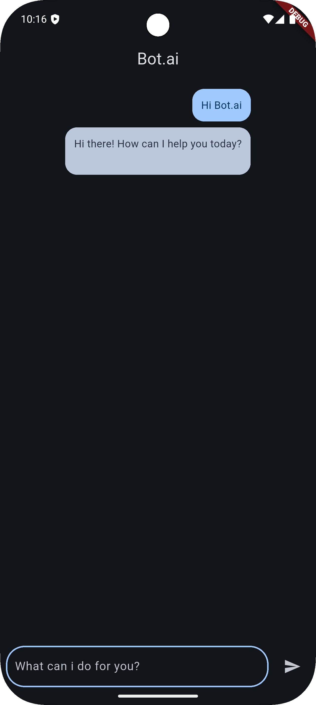

# 🤖 Bot.ai – Flutter Chatbot App

Bot.ai is a sleek and minimal chatbot app built using **Flutter** and powered by the **Gemini API** (or any LLM backend you integrate). This app offers a clean dark-themed chat interface where users can interact with the bot in real time.

---

## ✨ Features

- 🔹 Clean and modern UI using **Material 3**
- 🌙 **Dark theme** for a better visual experience
- 💬 Chat interface with user and bot bubbles
- 🧠 Easily integrate any AI model (like Gemini, GPT)
- 🎯 Fully responsive and customizable

---

## 📸 Screenshot

| App UI |
|--------|
|

> *You can replace the image link with your actual file path once you upload the screenshot to GitHub (`/screenshots/chat_ui.jpg`).*

---

## 🚀 Getting Started

### 📥 Clone the Repository

```bash
git clone https://github.com/Salman-747/Bot.ai.git
cd Bot.ai


